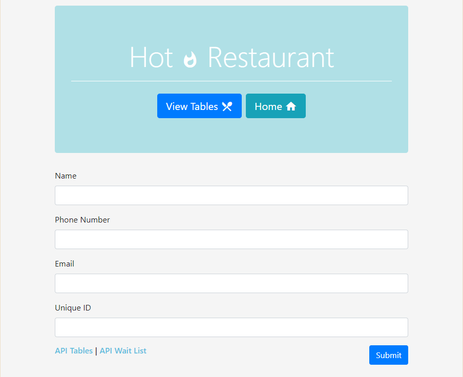

# Hot Restaurant Reservation App :fire::fork_and_knife:

### This reservation-taking and wait-listing app uses the fetch method to grab and post input data.

## *Table of Contents*

- [Description](#description)
- [Installation](#installation)
- [Usage](#usage)
- [Screenshots](#screenshots)
- [Contributing](#contributing)
- [Tests](#tests)
- [Questions](#questions)

## *Description*
Store reservation and waitlist data server-side and cleanly display it on an HTML page with this very simple fullstack app.

## *Installation*
Navigate into the root folder of the repository and open up a terminal. Type `npm i` to install the project's dependencies and `node server.js` to spin up the server on your local. Type `npm run watch` to view the project live in-browser.

## *Usage*
- Make Reservation :point_right: user input form and submit

- View Tables :point_right: see the current reservations up to three and the subsequent waitlist

- Delete + Clear All :point_right: remove entries

- API Tables + API Wait List :point_right: view the JSON objects containing input data

## *Screenshots*

## *Contributing*
Contributions welcome, raise issues and submit through pull requests.

## *Tests*
N/A

## *Questions?*
- My Profile: [katsign](https://github.com/katsign)

---
This project is  licensed. &copy; 2021